Версия `0.9`

1. Приложение включает в себя 3 функциональных блока:

-   Форма опроса 180
-   Форма опроса 360
-   Отчет по сотруднику

2. Интерфейс пользователя:

1) Формы опроса:

-   Переходя по ссылке пользователь в первую очередь проходит авторизацию в ЛЦ;
    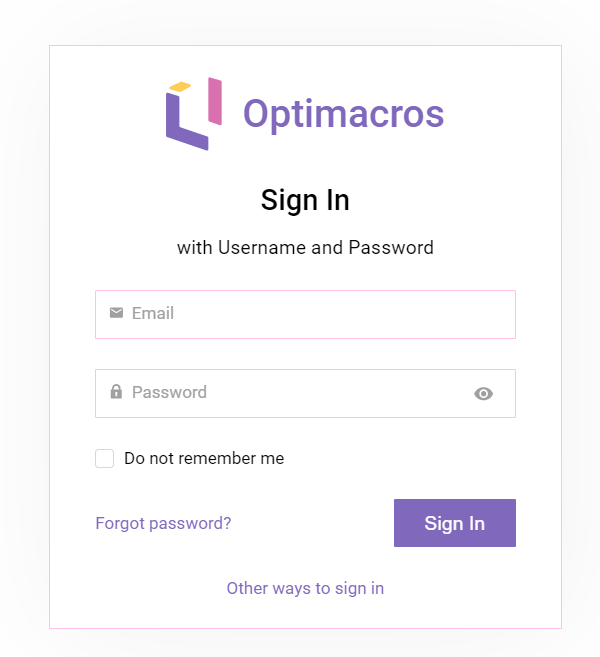
-   После авторизации перед пользователем предсталена форма опроса;
    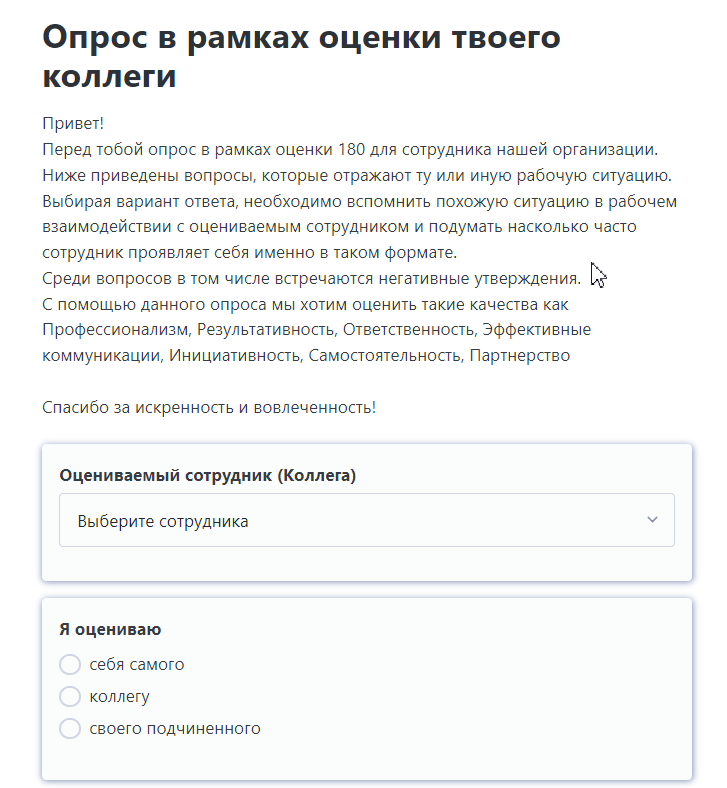
-   В выпадающем списке **Оцениваемого сотрудника** пользователю доступны назначенные ему в модели сотрудники;
    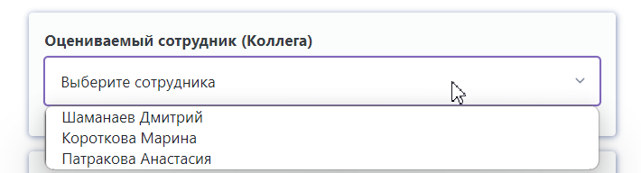
-   В зависимости от выбора варианта оценки в поле **Я оцениваю** меняется фон приложения;
    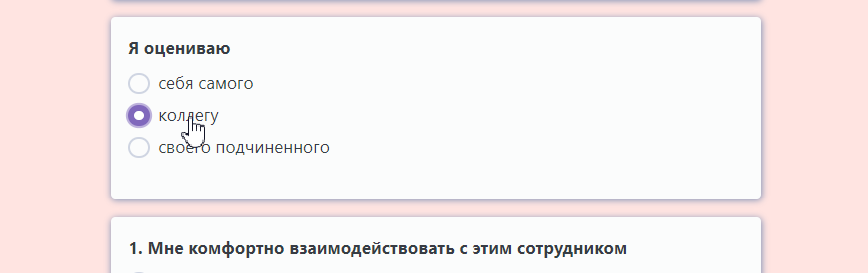
-   После выбора варинтов ответов в каждом вопросе и заполнении текстовых полей сотруднику необходимо нажать на кнопку **Отправить** для загрузки данных в модель для последующей обработки;
    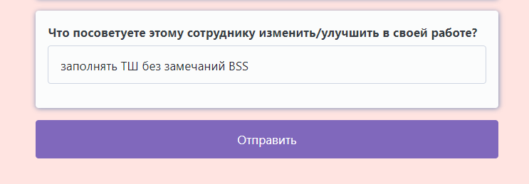
-   В случае если будет пропущен обязательный для заполнения вопрос система обратит на это внимание и результаты не будут направлено до заполнения всех обязятальных полей;
    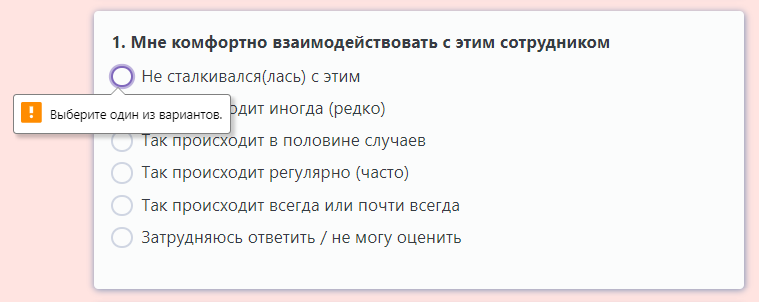
-   в случае успешной отправки пользователь увидит **сообщение об отправке** и может закрыть вкладку
    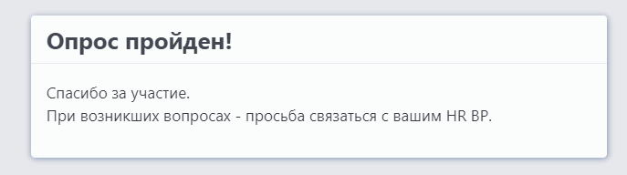
    `!на этом шаге опрос считается пройденным.`

2. Отчет по сотруднику:

-   Переходя по ссылке пользователь в первую очередь проходит авторизацию в ЛЦ;
    
-   После авторизации в верхнем правом углу для пользователя предстален селектор выбора интересующего сотрудника. После выбора сотрудника, форма автоматически начнет загрузку данных
    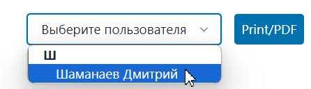
-   После загрузки данных пользователю предоставляется следующая информация:
-   отчет по сотруднику и информация о подразделении и должности
    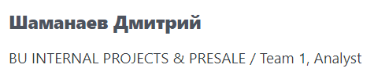
-   Radar/Spider диаграмма со сводными оценками от самого себя/коллег/руководителей/смежных подразделений по оцениваемым компетенциям
    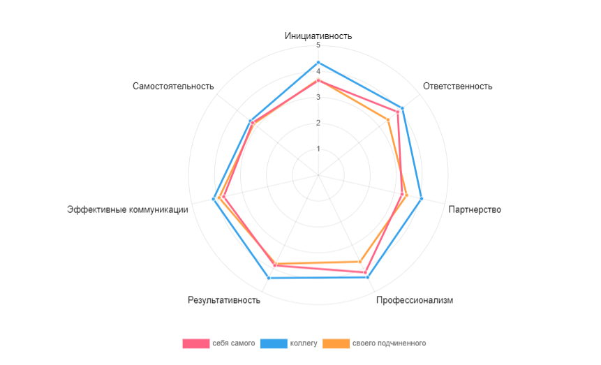
-   Советы с детализацией по виду оценки в табличном представлении
    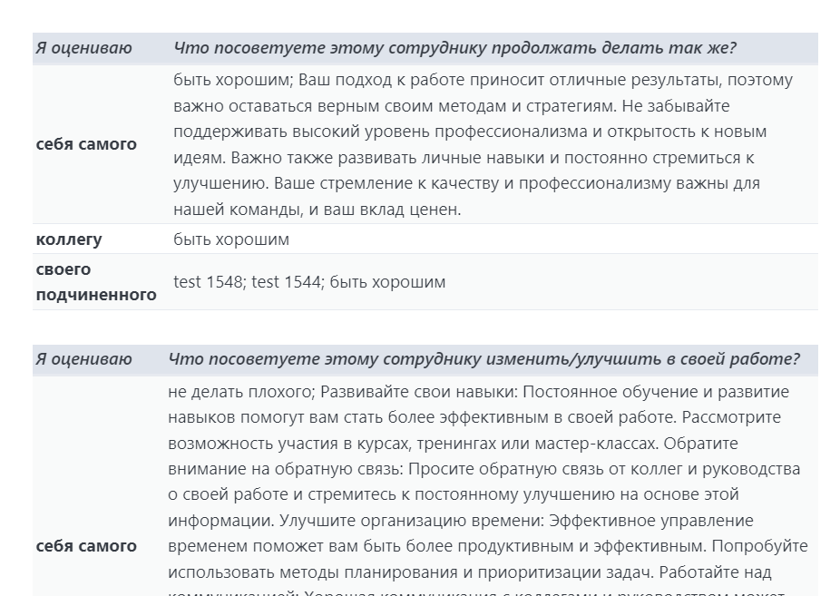
-   Информация о количестве заполненых форм опроса
    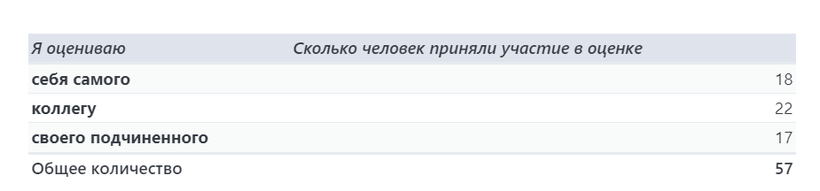

3. Кратко об архитектуре приложения:

-   источники данных представлены в `ENV.js`
-   приложение реализовано с применением 5 `webhandlers`
-   выделены отдельные модули для обработки данных, генерации html, работа с графиком
-   реализована параллельная запись данных из форм в модель
-   настройки цветовых параметров и всех вопросов/вариантов ответов представлены для гибкости и удобства в самой модели
-   авторизация через ЛЦ, фильтрация входных данных по данным пользователя ЛЦ
-   данные **Отчета** доступны сотрудникам HR
-   передача данных в модель с максимальным использованием longId элементов для облегчения мэппинга и дальнейших расчетов в модели

4. Ресурсы, используемые при разработке (библиотеки, фреймворки):

-   CSS https://picocss.com/
-   Radar/Spider chart https://www.chartjs.org/docs/latest/charts/radar.html
-   Compression https://www.npmjs.com/package/lz-string
-   HTML https://rucom.optimacros.com/topic/44293
